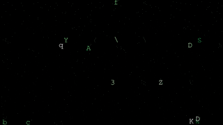
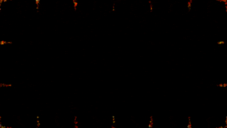

# Particle Animator

## Introduction
This Python app uses Emitters to generate particles. The emitters and particles are animated via various physical forces such as acceleration, angular velocity, etc. This can be used to generate various animations.

## Methodology
The app uses `numpy` and plain arrays to manage emitters and particles. The drawing of lines, and various other shapes are done via `pycairo` and `mathplotlib`. The app does not generate the video directly. Instead, each frame is written out in the `images/` directory and an external tool such as `ffmpeg` can be used to make the final video. For example:

```shell
cd images; ffmpeg -y -pattern_type glob -i '*.png' -c:v libx264 -r 30 ../output.mp4; cd ..
```

## Command Line Options
The program can run without any command line options at all because all options have defaults:

```text
usage: particle_animator.py [-h] [-d] [-st START] [-e END] [-s SKIP]

options:
  -h, --help          show this help message and exit
  -d, --debug         Debug mode: creates smaller images for faster feedback
  -st, --start START  Start frame, defaults to 1
  -e, --end END       End frame, defaults to 240
  -s, --skip SKIP     Skip frames, defaults to 1
```

Tips: When experimenting, use `-d` option for smaller output files. Otherwise, the default behavior is to generate 4K files which are much slower. If you want to see animation develop quickly, you can also consider skipping frames using `-s 5` option. This will generate only the 5th frame.

## Demo

There is currently no configuration file or input file. Therefore, the emitters, particles and their behavior are all coded directly in the Python files. In the future, I plan to make this program more general so that it can be configured externally. These demos were created by my program but are tricky to reproduce because the program and the demo have evolved significantly since. 






PS: If you are curious, these demos were generated using [gifski](https://gif.ski/):

```shell
gifski --fast-forward 3 --fps 6 --width 320 -o docs/stars_swirling_orange.gif movies/stars_swirling_orange.mp4
```

# License

This code is provided under the "Creative Commons NonCommercial NoDerivatives" license. AKA [CC BY-NC-ND](https://github.com/Gibberlings3/GitHub-Templates/blob/master/License-Templates/CC-BY-NC-ND-4.0/LICENSE-CC-BY-NC-ND-4.0.md). 

